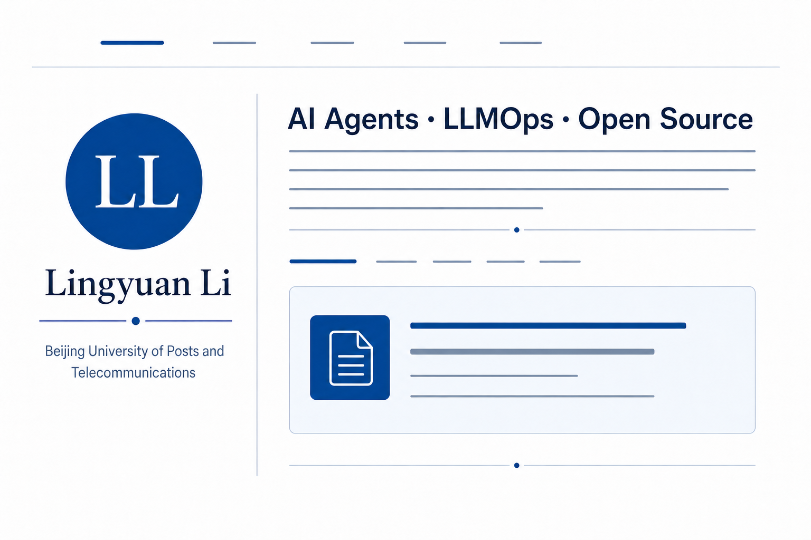

# Lingyuan Li — Personal Homepage

Personal academic homepage for **Lingyuan Li**, featuring my background, education, current interests, and selected open-source projects.

## About

I am an undergraduate student at Beijing University of Posts and Telecommunications, majoring in Internet of Things Engineering in the BUPT–Queen Mary University of London joint programme.

My interests include:

- AI agents and multi-agent systems
- Large language models and LLMOps
- AI infrastructure and developer platforms
- Open-source software engineering

> “The skeptic sees truth, the hopeful pave paths.”

## Education

### Beijing University of Posts and Telecommunications

- B.Eng. in Internet of Things Engineering
- Sep. 2023 – Jun. 2027 (Expected)

### Queen Mary University of London

- B.Eng. in Internet of Things Engineering
- Sep. 2023 – Jun. 2027 (Expected)

## Selected Projects

- [**MultiGen**](https://github.com/lingyuanli/MultiGen) — A general-purpose framework for multimodal, multi-agent collaboration and end-to-end task execution.
- [**FrameLoom**](https://github.com/lingyuanli/FrameLoom) — An agent-native open-source video editor driven by natural-language instructions.
- [**LLMOps Platform**](https://github.com/lingyuanli/llmops-ai-agent-development-platform) — A low-code platform for building, evaluating, and operating LLM applications.

## Website

The public homepage is available at:

**[https://lingyuanli.github.io/](https://lingyuanli.github.io/)**

GitHub Pages serves the static entry point from **index.html**. The React/vinext source is kept in **app/**.

## Local Development

Requirements:

- Node.js 22.13 or newer
- npm

    npm install
    npm run dev

Then open [http://localhost:3000](http://localhost:3000).

To verify the production build:

    npm run build

## Contact

- GitHub: [@lingyuanli](https://github.com/lingyuanli)
- Email: [2210127151@qq.com](mailto:2210127151@qq.com)
- Project site: [www.manus.llmops.org.cn](https://www.manus.llmops.org.cn)
